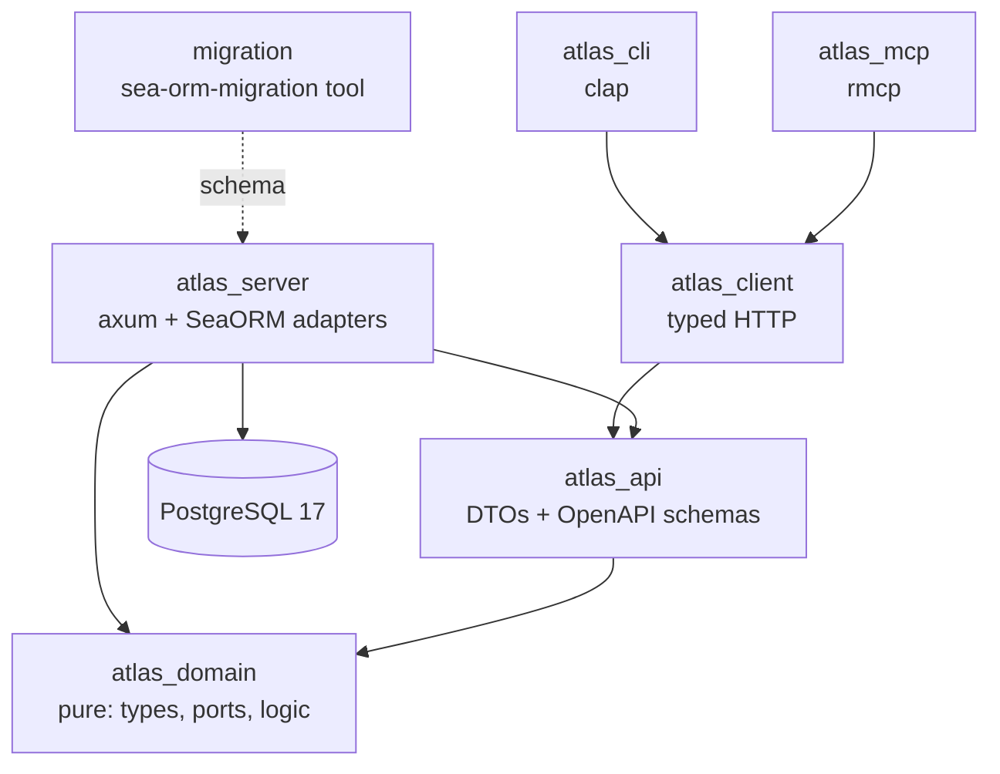
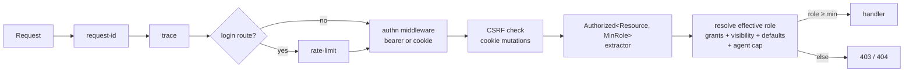

# Architecture — Atlas

Atlas is a hexagonal (ports-and-adapters) Rust monorepo: a pure domain core, a server that adapts it to HTTP + PostgreSQL, and thin clients (CLI, MCP) that speak the same types over the wire. One REST API serves humans (web), agents (MCP), and scripts (CLI) alike. This document is the canonical map of where things live and why. For per-change detail, see the SDD artifacts mirrored under the Obsidian vault `sdd/atlas/`.

## Layered crate map

The dependency direction is strict and **compiler-enforced**: `atlas_domain` declares only `serde`/`thiserror`/`uuid`/`chrono`, so an accidental `use sea_orm` or `use axum` in the domain fails to compile.

| Crate | Responsibility | Notable contents |
|-------|----------------|------------------|
| `atlas_domain` | Pure types, value objects, errors, **repository ports** (traits taking `WorkspaceCtx`), and pure logic (permission resolution, revision diff/anchor, fractional positions) | `entities/`, `ports/`, `permissions.rs`, `ids.rs` |
| `atlas_api` | The wire contract: shared DTOs + their OpenAPI (`utoipa`) schemas + the pagination codec | `dtos/`, `pagination.rs`, `problem.rs` |
| `atlas_client` | Typed HTTP client over `atlas_api`/`atlas_domain` types; the single client used by CLI, MCP, and e2e tests | `lib.rs` |
| `atlas_server` | The axum binary: auth, permission enforcement, routing, and SeaORM **adapters** implementing the domain ports | see module tree below |
| `atlas_cli` | `atlas` command-line over `atlas_client` | `lib.rs` |
| `atlas_mcp` | MCP server (`rmcp`) over `atlas_client` | `lib.rs` |
| `migration` | `sea-orm-migration` tool crate, run via `cargo run -p migration -- <up\|fresh>` | one migration file per schema slice |

## Request lifecycle

Every request passes a fixed middleware stack, then a per-route authorization extractor. An undeclared route cannot reach a handler authenticated; a protected route declares its target resource + minimum role in its signature.

- **authn**: `Authorization: Bearer` (sessions and `atlas_` API keys, distinguished by prefix) or the HttpOnly `atlas_session` cookie. Sessions enforce revocation + expiry + the user's `disabled_at`; API keys enforce revocation + expiry + the **creating user's** `disabled_at`.
- **CSRF**: cookie-authenticated state-changing requests require `X-Atlas-CSRF: 1` (SameSite=Lax + custom header); bearer and safe methods are exempt.
- **authz**: the `Authorized<R, M>` extractor loads the principal's applicable grants, runs the pure `resolve()` engine, and compares the effective role to the route's declared minimum.

## `atlas_server` module tree

| Module | Holds |
|--------|-------|
| `auth/` | `password` (argon2 in `spawn_blocking`), `tokens`, `middleware` (authn), `csrf` |
| `authz/` | `Authorized<R,M>` extractor + concrete `WorkspaceMember` / `RequireUserAdmin` extractors |
| `routes/` | One module per resource (`auth`, `users`, `api_keys`, `projects`, `grants`, `workspaces`, `health`); `registry` (route source of truth); `openapi` (utoipa doc + Scalar) |
| `middleware/` | `problem_stamp` (request-id into error bodies) |
| `persistence/entities/` | SeaORM entity structs (DB shape) — never leak into `atlas_domain` |
| `persistence/repos/` | Adapters implementing the domain ports; map entity ↔ domain |
| `persistence/bootstrap` | Root-user seed (`ATLAS_ROOT_PASSWORD`, fail-fast) + dev seed |

`atlas_domain` mirrors the data subsystems in `entities/` and exposes them through `ports/` (one trait module per aggregate: identity, workspace_core, documents, boards_tasks, permission_grant_repo).

## Data model

PostgreSQL 17, 17 tables. IDs are app-generated **UUIDv7** (time-ordered). Full schema and ER diagram: `sdd/atlas/atlas-e02-data-model-design-2026-06-12` (Obsidian). Highlights:

| Area | Tables | Notes |
|------|--------|-------|
| Tenancy + identity | workspaces, users, sessions, api_keys, workspace_memberships | `workspace_id NOT NULL` on every domain table; `users`/`sessions`/`api_keys` are the tenancy-root exceptions |
| Content | folders, documents, document_revisions, document_links, attachments | document content is `TEXT` (TOAST); revisions are line diffs with snapshot anchors; attachments are metadata-only (blobs live in object storage → Cloudflare R2) |
| Projects + tasks | projects, boards, board_columns, tasks, task_references | readable IDs `PREFIX-n` per project (immutable); kanban order via `fractional_index` `TEXT` position |
| Properties + access | property_definitions, permission_grants | hybrid free-frontmatter (jsonb) + typed properties; grants `(principal, resource, role)` |

Every domain row records its `created_by` actor (user XOR api_key, DB CHECK), enabling human-vs-agent attribution.

## Permission model

Resource-sharing (not IAM). Grants `(principal, resource, role)` with roles `viewer < editor < admin` (+ `owner`, workspace-only) inheriting down `workspace > project > folder > document | board`. Most-specific grant wins; **default deny**. Visibility (`private` / `workspace` / `public`) is sugar over implicit grants. Defaults: a resource creator gets `admin`; workspace owner/admin hold implicit admin over all workspace resources; new resources default to `workspace`-edit visibility. **Agents (API keys) are capped at `editor` and never manage grants.** The list query (`list_visible`) mirrors the `resolve()` engine in both directions so a listed resource and its detail endpoint always agree. Full model: `Atlas/E00-diseno-de-producto/E00-permisos` (Obsidian).

## Cross-cutting conventions

| Concern | Approach |
|---------|----------|
| Multi-tenancy | Every domain port takes `WorkspaceCtx`; a query that forgets `workspace_id` cannot be written through the port. Cross-tenant isolation has per-repository integration tests. |
| Errors | RFC 9457 `application/problem+json` + `request_id` + an actionable `hint`; internal errors return a generic detail and never leak internals. |
| Pagination | Opaque base64url cursors over UUIDv7 in a `Page<T>` envelope (default 50, max 200). |
| API contract | OpenAPI generated from `utoipa` annotations, served at `/openapi.json` + Scalar at `/scalar`. Route coverage is driven by `ROUTE_REGISTRY` (`routes/registry.rs`): the registry→router and registry→doc directions are audited; a route added to the router without a registry entry is **not** auto-caught (axum 0.8 exposes no Router introspection) — developers must update the registry. |
| Testing | Strict TDD; integration tests run against real Postgres with a database-per-test harness; e2e tests drive a real `TcpListener` server through `atlas_client`. |

## Next step

When a new subsystem lands (documents/boards/tasks endpoints in E04/E05, search in E06, MCP tools in E08), extend the matching `routes/` module, add its `ROUTE_REGISTRY` entries, and update the relevant table here.
