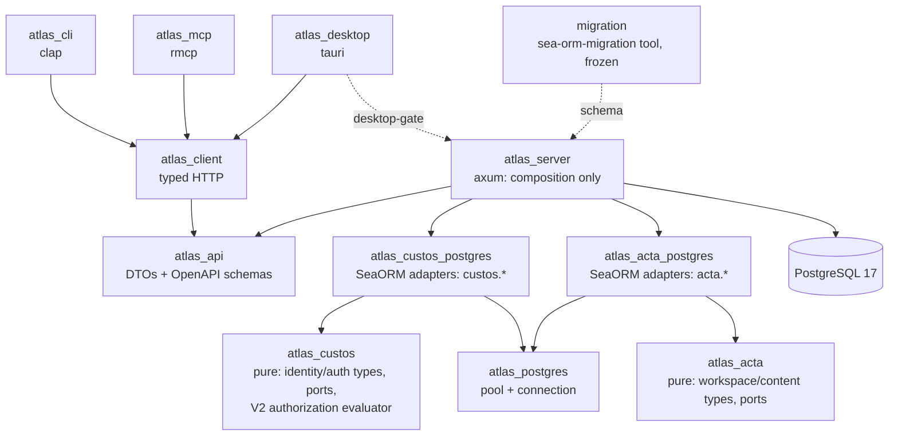
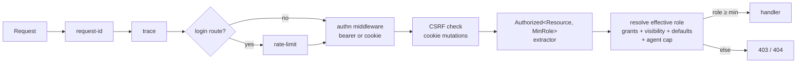

# Architecture — Atlas

Atlas is a hexagonal (ports-and-adapters) Rust monorepo: a pure domain core, a server that adapts it to HTTP + PostgreSQL, and thin clients (CLI, MCP) that speak the same types over the wire. One REST API serves humans (web), agents (MCP), and scripts (CLI) alike. This document is the canonical map of where things live and why. For per-change detail, see the SDD artifacts mirrored under the Obsidian vault `sdd/atlas/`.

## Layered crate map

13 workspace members (plus the `atlas_test_db`/`atlas_test_harness` test utilities), matching the
root `Cargo.toml`'s `[workspace] members` exactly. The dependency direction is strict and
**compiler-enforced**: `atlas_custos` declares only `atlas_core`/`async-trait`/`serde`/
`serde_json`/`uuid`/`chrono`, and `atlas_acta` only `atlas_core`/`async-trait`/`serde`/`serde_json`/
`thiserror`/`uuid`/`chrono`/`bytes`/`diffy-imara`/`fractional_index`, so an accidental `use sea_orm`
or `use axum` in either fails to compile. `atlas_custos` and `atlas_acta` never depend on each other
— they compose only through `atlas_server`. Since V2-E2, the SeaORM adapters for each pure crate
live in their own Postgres crate (`atlas_custos_postgres`, `atlas_acta_postgres`), not in
`atlas_server`; `atlas_server` depends on both and composes them, but owns no product entity/repo
logic of its own.

```mermaid
flowchart TD
    cli[atlas_cli<br/>clap] --> client[atlas_client<br/>typed HTTP]
    mcp[atlas_mcp<br/>rmcp] --> client
    desktop[atlas_desktop<br/>tauri] --> client
    desktop -. desktop-gate .-> server
    client --> api[atlas_api<br/>DTOs + OpenAPI schemas]
    server[atlas_server<br/>axum: composition only] --> api
    server --> custospg[atlas_custos_postgres<br/>SeaORM adapters: custos.*]
    server --> actapg[atlas_acta_postgres<br/>SeaORM adapters: acta.*]
    custospg --> custos[atlas_custos<br/>pure: identity/auth types, ports,<br/>V2 authorization evaluator]
    actapg --> acta[atlas_acta<br/>pure: workspace/content types, ports]
    custospg --> pgcore[atlas_postgres<br/>pool + connection]
    actapg --> pgcore
    migration[migration<br/>sea-orm-migration tool, frozen] -.schema.-> server
    server --> pg[(PostgreSQL 17)]
```

| Crate | Responsibility | Notable contents |
|-------|----------------|------------------|
| `atlas_core` | Neutral V2 platform contracts: identifiers, compiled-registry types and `registry::build()` validation, capability traits, and the component config contract | `ids/`, `registry/`, `capabilities/`, `config/` |
| `atlas_postgres` | Neutral Postgres runtime — pool configuration and connection construction, with no product repositories or entities | `config.rs`, `connect.rs` |
| `atlas_custos` | Pure identity/auth types, value objects, and **repository ports**: users, sessions, api keys, groups, security audit, capability scopes; plus the pure V2 authorization evaluator, the `AuthorizationService` that loads its facts, and Custos's own resource provider (see [V2 authorization model](#v2-authorization-model)) | `entities/`, `ports/`, `eval/`, `authorize/`, `provider/`, `capability.rs`, `ids.rs` |
| `atlas_acta` | Pure workspace/content types, value objects, and **repository ports**: workspaces, projects, folders, documents, boards/tasks, comments, plus pure logic (permission resolution, revision diff/anchor, fractional positions, wikilinks) | `entities/`, `ports/`, `permissions.rs`, `ids.rs`, `wikilink.rs` |
| `atlas_custos_postgres` | SeaORM entities + repository **adapters** implementing every `atlas_custos` port against the `custos.*` schema | `entities/`, `repos/`, `migrations/` |
| `atlas_acta_postgres` | SeaORM entities + repository **adapters** implementing every `atlas_acta` port against the `acta.*` schema (documents, boards/tasks, comments, search, webhooks, automation, …) | `entities/`, `repos/`, `migrations/` |
| `atlas_api` | The wire contract: shared DTOs + their OpenAPI (`utoipa`) schemas + the pagination codec | `dtos/`, `pagination.rs`, `problem.rs` |
| `atlas_client` | Typed HTTP client over `atlas_api` types; the single client used by CLI, MCP, and e2e tests | `lib.rs` |
| `atlas_server` | The axum binary: auth, permission enforcement, routing, and composition of the `atlas_custos_postgres`/`atlas_acta_postgres` adapters — no product entity/repo implementations of its own | see module tree below |
| `atlas_cli` | `atlas` command-line over `atlas_client` | `lib.rs` |
| `atlas_mcp` | MCP server (`rmcp` 3.1.4) over `atlas_client`; serves both the `2026-07-28` revision and the legacy `2025-11-25`-and-earlier era, and advertises verb-shaped tools whose resources resolve through `catalog.rs` | `lib.rs`, `catalog.rs` |
| `atlas_desktop` (`apps/desktop/src-tauri`) | Tauri desktop shell wrapping the web SPA; can embed `atlas_server` behind a `desktop-gate` feature for local/offline runs | `src-tauri/src/` |
| `migration` | `sea-orm-migration` tool crate; historical and byte-frozen, carrying the pre-split migration history untouched by V2-E2 | one migration file per schema slice |

## Request lifecycle

Every request passes a fixed middleware stack, then a per-route authorization extractor. An undeclared route cannot reach a handler authenticated; a protected route declares its target resource + minimum role in its signature.

```mermaid
flowchart LR
    req[Request] --> rid[request-id]
    rid --> trace[trace]
    trace --> rl{login route?}
    rl -- yes --> gov[rate-limit]
    rl -- no --> authn
    gov --> authn[authn middleware<br/>bearer or cookie]
    authn --> csrf[CSRF check<br/>cookie mutations]
    csrf --> ext["Authorized&lt;Resource, MinRole&gt;<br/>extractor"]
    ext --> res[resolve effective role<br/>grants + visibility + defaults<br/>+ agent cap]
    res -- role &ge; min --> h[handler]
    res -- else --> deny[403 / 404]
```

- **authn**: `Authorization: Bearer` (sessions and `atlas_` API keys, distinguished by prefix) or the HttpOnly `atlas_session` cookie. Sessions enforce revocation + expiry + the user's `disabled_at`; API keys enforce revocation + expiry + the **creating user's** `disabled_at`.
- **CSRF**: cookie-authenticated state-changing requests require `X-Atlas-CSRF: 1` (SameSite=Lax + custom header); bearer and safe methods are exempt.
- **authz**: the `Authorized<R, M>` extractor loads the principal's applicable grants, runs the pure `resolve()` engine, and compares the effective role to the route's declared minimum.

## `atlas_server` module tree

| Module | Holds |
|--------|-------|
| `auth/` | `password` (argon2 in `spawn_blocking`), `tokens`, `middleware` (authn), `csrf` |
| `authz/` | `Authorized<R,M>` extractor; the `ResolvedResource` types it resolves (`WorkspaceRes`, `ProjectRes`, `FolderRes`, `BoardRes`, `TaskRes`, `DocumentRes`, `DocumentSlugRes`) + the non-resource extractors `WorkspaceMember` / `RequireUserAdmin`. `DocumentSlugRes` accepts **either** a stable document UUID or its slug |
| `routes/` | One module per resource (`auth`, `users`, `api_keys`, `workspaces`, `members`, `projects`, `folders`, `documents`, `boards`, `tasks`, `grants`, `search`, `health`); `registry` (route source of truth); `openapi` (utoipa doc + Scalar); `validation` (shared input checks) |
| `middleware/` | `problem_stamp` (request-id into error bodies) |
| `persistence/entities/` | Only the `platform.ui_state` SeaORM entity (`identity.rs`) — every product entity moved to `atlas_custos_postgres`/`atlas_acta_postgres` in V2-E2 |
| `persistence/repos/` | Only `platform.ui_state`'s `PgUiStateRepo`, plus composition-only glue that genuinely spans Custos and Acta in one function: the security-audit-append helpers (`security_audit.rs`), `PgProjectRepo`/`PgFolderRepo` (`workspace_core.rs`), the attachment repos and stores (`documents.rs`, `attachment_store.rs`, `s3_attachment_store.rs`, `workspace_attachments.rs`, `comment_attachment_drafts.rs`), `PgIntegrationConfigRepo`'s Custos-key provisioning, `PgSemanticIndexer`, cross-domain diagnostics (`grant_diagnostics.rs`), and the domain-crate `PermissionGrantRepo` re-export (`permissions.rs`) — no standalone re-export facade over either Postgres crate |
| `persistence/bootstrap` | Root-user seed (`ATLAS_ROOT_PASSWORD`, fail-fast) + dev seed |

`atlas_custos` and `atlas_acta` mirror the data subsystems in `entities/` and expose them through
`ports/` (one trait module per aggregate: identity, workspace_core, documents, boards_tasks,
permission_grant_repo — the last of which lives in `atlas_server::authz` since it composes across
both crates). `atlas_custos_postgres` and `atlas_acta_postgres` implement those ports against
`custos.*`/`acta.*` respectively; `atlas_server` imports their concrete adapter types directly —
there is no curated re-export prelude in `atlas_server::persistence`.

### HTTP surface

| Group | Endpoints (representative) |
|-------|----------------------------|
| Auth + account | `POST /v1/auth/login` · `POST /v1/auth/logout` · `GET /v1/auth/me` (returns id, username, email, display_name, is_root) · `POST /v1/auth/change-password` · `PATCH /v1/users/me` (email, display name) |
| Users (root/admin) | `GET /v1/users` · `POST /v1/users` · `POST /v1/users/{id}/disable\|enable` · `POST /v1/users/{id}/reset-password` |
| Workspaces | `GET /v1/workspaces` · `GET /v1/workspaces/{ws}/members` · agent API keys `…/api-keys` (create/list/revoke) |
| Notes | projects · folders · documents (CAS content save, revisions, **backlinks**); a document is addressable by stable **UUID or slug** |
| Tasks | boards · board columns · tasks (atomic move, assignees, references, activity) · sub-tasks (`…/tasks/{id}/subtasks` create/list, `…/tasks/{id}/promote` to detach onto the board) |
| Search | `GET /v1/workspaces/{ws}/search` (ranked docs+tasks, permission-filtered, filter tokens) |
| Attachments | `GET /v1/workspaces/{ws}/attachments` (every file on a note, task, or comment of either — permission-filtered, with its owner and uploader) · `GET\|PATCH\|DELETE …/attachments/{id}` (download, rename, delete); a rename also rewrites the `[[file:…]]` links addressing it |
| Sharing + meta | grants (`…/grants`) · `GET /v1/meta` (server version/build) |
| V2 authorization (platform admin) | `GET\|POST /api/v2/custos/roles` · `PATCH\|DELETE …/roles/{role_id}` · `GET\|POST /api/v2/custos/grants` · `DELETE …/grants/{grant_id}` · `GET\|POST /api/v2/custos/denies` · `DELETE …/denies/{deny_id}` — administration of the V2 records only; see [V2 authorization model](#v2-authorization-model) for what they can target today |

## Data model

PostgreSQL 17, three live schemas: `custos.*` (8 tables, owned by `atlas_custos_postgres`),
`acta.*` (36 tables, owned by `atlas_acta_postgres`), and `platform.*` (1 table, `ui_state`, owned
directly by `atlas_server`) — there is no remaining `public.*` product table. IDs are
app-generated **UUIDv7** (time-ordered). Full schema and ER diagram:
`sdd/atlas/atlas-e02-data-model-design-2026-06-12` (Obsidian). The table below is a representative,
non-exhaustive subset predating the schema split — table names are unchanged by the move, only
their owning schema and crate:

| Area | Tables | Notes |
|------|--------|-------|
| Identity (`custos.*`) | principals, users, sessions, user_activation_tokens, api_keys, groups, group_members, permission_grants, security_audit_log, roles, grants_v2, deny_rules | the twelve Custos tables (`roles`, `grants_v2` and `deny_rules` hold the V2 authorization model: administered through the V2 routes, not yet consulted when a request is authorized); `users`/`sessions`/`api_keys` are the tenancy-root exceptions to `workspace_id NOT NULL` |
| Tenancy (`acta.*`) | workspaces, workspace_memberships | workspaces are an Acta concept (no other product has them); memberships FK into `custos.users` |
| Content (`acta.*`) | folders, documents, document_revisions, document_links, attachments | document content is `TEXT` (TOAST); revisions are line diffs with snapshot anchors; attachments are metadata-only (blobs live in object storage → Cloudflare R2). `document_links` is the wikilink/backlink graph, bound to the **stable target id** |
| Projects + tasks (`acta.*`) | projects, boards, board_columns, tasks, task_references, task_assignees, task_checklist_items, task_activity | readable IDs `PREFIX-n` per project (immutable); kanban order via `fractional_index` `TEXT` position; multiple assignees (user/agent), actor-attributed activity log. **Sub-tasks** are full tasks linked by `tasks.parent_task_id`: they carry every task field (status, assignees, description, tags, estimate, their own `readable_id` so they are wikilink-referenceable) but are excluded from the board listings (`parent_task_id IS NULL`); promoting one clears the parent so it appears on the board |
| Properties (`acta.*`) | property_definitions | hybrid free-frontmatter (jsonb) + typed properties; grants `(principal, resource, role)` live in `custos.permission_grants` (listed under Identity above) with opaque `resource_ref` targets |
| UI state (`platform.*`) | ui_state | per-user UI preferences, owned directly by `atlas_server`, not by either product crate |

Every domain row records its `created_by` actor (user XOR api_key, DB CHECK), enabling human-vs-agent attribution. `users` carry an optional `email` (recovery only). **Wikilinks** are written as `[[<uuid>|Display Title]]` — bound to the target's stable id so they survive renames; the legacy `[[Title]]` form still resolves by slug. Slugs are immutable after creation, so addressing a document by UUID or by slug both resolve.

## Permission model

Resource-sharing (not IAM). Grants `(principal, resource, role)` with roles `viewer < editor < admin` (+ `owner`, workspace-only) inheriting down `workspace > project > folder > document | board`. Most-specific grant wins; **default deny**. Visibility (`private` / `workspace` / `public`) is sugar over implicit grants. Defaults: a resource creator gets `admin`; workspace owner/admin hold implicit admin over all workspace resources; new resources default to `workspace`-edit visibility. **Agents (API keys) are capped at `editor` and never manage grants.** The list query (`list_visible`) mirrors the `resolve()` engine in both directions so a listed resource and its detail endpoint always agree. Full model: `Atlas/E00-diseno-de-producto/E00-permisos` (Obsidian).

### V2 authorization model

**Every request is still authorized by the resource-sharing model above.** The V2 model (V2-E5) exists beside it: its records are stored and administered, a pure evaluator plus a fact-loading service decide over them, and since V2-E7 every workspace-scoped Acta route declares the V2 question it will ask and can evaluate it in shadow beside the V1 decision. No V1 decision, list filter or 403/404 changes until the cutover.

| Part | Where | Role |
|------|-------|------|
| Evaluator | `atlas_custos::eval` | Pure decisions over caller-supplied facts: single and batch evaluation, the list visibility predicate, the catalog, delegation, effective actions, and conversions from stored records |
| Storage | `custos.roles`, `custos.grants_v2`, `custos.deny_rules` (`atlas_custos_postgres`) | Custom roles, grants and deny rules. A grant has exactly one subject (principal, group or principal set), one target (ref, path or selector, stored as canonical text) and one authority (built-in `name@version`, custom role, or explicit action list) |
| Deny mode | `ATLAS_EXPLICIT_DENY_MODE` (`CustosConfig`) | `disabled` (default) or `audit`. `enforced` is rejected at config load: the runtime does not evaluate deny rules yet, so accepting it would promise enforcement that does not happen. Deny rows persist across mode changes |
| Admin routes | `/api/v2/custos/{roles,grants,denies}` | Platform-admin and root sessions only; every API key gets 403. Every write is validated through the catalog and writes its audit row in the same transaction |
| Authorization service | `atlas_custos::authorize` | Loads the facts one request needs and runs the evaluator |
| Provider contract | `ResourceProvider::resource_facts` (`atlas_core::capabilities`) | Existence and current path for many resources in one call |
| Custos provider | `atlas_custos::provider` + `PgCustosResourceStore` | Answers `resource_facts` for Custos resource kinds |

#### Evaluator rules

- **Precedence.** Grants reaching the actor are matched against the target's chain. The nearest level wins, then the strongest tier within it (ref > path > selector, with selector tie breakers), and equal tiers union their actions. There is no fallback to a weaker tier or a farther level. The credential ceiling, supplied by the caller, intersects the result.
- **Denies.** In `enforced` mode a deny on the action at the target or any ancestor removes the action whatever the grant precedence; `audit` reports the rules that would change the decision without applying them; `disabled` ignores them. Root is exempt; platform admins are not.
- **Discovery.** The requested action held gives `Allowed`, another action on the target's own kind gives `Denied`, and no effective action gives `NotFound`, indistinguishable from a missing target. Hidden results carry no grant or deny metadata.
- **Fail closed.** Missing ancestry, facts bound to another principal, or unknown group membership that could decide the outcome are technical errors, never an allow. Unknown principal-set membership reads as nonmember.
- **Batch and lists.** A batch returns one result per target in input order; an unavailable target is `NotFound`. The visibility predicate (`All`, `Nothing`, or grant rules plus deny targets) permits a path exactly when single evaluation returns `Allowed`, and fails as a whole on unknown membership that could decide any row.
- **Catalog.** Built from plain per-product data: kinds, actions, versioned built-in roles and declared principal sets. It validates targets, custom roles (non-empty, one product, never a `custos::` action) and grant specs (one subject, one target, one authority of the target's product).
- **Delegation.** An action set may add the Custos delegation actions (`custos::grant::create|delete`, `custos::group::create|update|delete|add_member|remove_member`) to one product's actions. Precedence runs in separate lanes, so a delegation-only grant never shadows product authority and the reverse; delegation authority never discloses a target. `effective_actions` computes what an actor holds on a target, and `can_delegate` requires `custos::grant::create` there and that the granted actions are a subset of it.

#### Admin routes in this release

- Custos and Acta declare V2 resource kinds in the registry (`reg5.rs`, the product's catalog declaration), so their targets are accepted; a product without a published catalog answers 422. Acta also declares its versioned built-in roles (`viewer`/`editor`/`admin` @1) and the `members` principal set.
- Custom roles may never carry Custos actions, so custom roles exist for Acta; a built-in role authority is accepted only for a product that declares that role.
- Creating or deleting a deny rule answers 409 while the deny mode is `disabled`. Stored denies are inert either way: nothing evaluates them for requests yet.

#### Per-route V2 declarations and shadow authorization (V2-E7 S2)

- **Declaration rule.** Every non-public, workspace-scoped Acta route declares `v2: Some(V2Target { kind, action, target })` in `reg5.rs`: the V2 kind of the resource the handler resolves, the catalog action evaluated on it, and how the handler locates it (`TargetSource`: the V1-resolved workspace/project/folder/document/board/task, a comment or attachment path parameter, or a workspace child named by a parameter). Creation routes target the container with the child's `create`; kind-specific lists target their container with the child's `read` (documents under a project ask `document::read` on the project, saved searches ask `saved_search::read` on the workspace); workspace-wide lists, search, activity and the event stream target the workspace with its `read`, `read_activity` or `subscribe_events`; moves and copies declare the source. Platform-scoped Acta routes (`/admin/*`, the workspace collection) declare nothing (`router_audit::V2_PLATFORM_SCOPED_PATHS`). Both directions are audited: every declaration names a catalog action on the source's kind, and every mounted route has its declaration.
- **Shadow mode.** `ATLAS_CUSTOS_SHADOW_AUTHORIZE` (`CustosConfig`): `off` (default, no cost), `log`, `metrics`. When on, the V1 extractors (`Authorized<..>`, `WorkspaceMember`, `WorkspaceAccess`, `WorkspaceOwnerOrAdmin`) ask `AppState.authorization` the declared question for the actor and target they resolved, within a 100 ms budget separate from the provider timeout, and record `atlas_v2_shadow_total{component, operation, outcome}` plus a structured `authz.v2_shadow` line with the route, kind, action and both decisions, never a reason. Outcomes: `agree` (logged at debug), `v1_allow_v2_deny`, `v1_allow_v2_not_found`, `v1_deny_v2_allow`, `v1_notfound_v2_allow`, `v2_unavailable` (budget exhausted, provider missing or failing) and `skipped` (the route declares a target but V1 refused before one was resolved), all logged at info. The V1 decision is returned unchanged and no audit row is written.
- **Key ceiling.** An API key's V1 scopes translate to V2 actions through `authz::v2_ceiling` (each plural family stands for the singular actions of its kind; `config` reads the workspace and manages its configuration; `grants:read` is `custos::grant::read`); no scope maps to `custos::grant::create`.

#### Authorization service and providers

- **One provider call and one load.** `authorize`, `authorize_batch` and `effective_actions` make at most one `resource_facts` call per target product and one stored-facts load; `visibility_filter` makes no `resource_facts` call. The load returns the grants and deny rules addressed to the actor, its groups (from the V1 group tables) or any principal set, plus the custom roles they reference; principal-set membership is resolved through the owning provider's `members_of` only for sets a loaded row names.
- **Fail-closed mapping.** A provider failure or timeout makes the affected targets unavailable: a single authorization or effective-actions call fails with `FactsUnavailable` and a typed cause, a batch reports those targets as `NotFound`. A store or membership-source failure fails the request; nothing is narrowed into an allow.
- **Injected timer.** `atlas_custos` stays runtime-free, so provider calls race a `Sleeper` the composition root injects (default timeout 2 s). A sleeper that never fires lets a hanging provider hang the request.
- **Canonical ids.** The Custos provider answers only for lowercase hyphenated UUID ids; any other spelling of an existing id is missing, so an alias cannot escape a deny stored on the canonical id. Paths are single-segment, the platform is the singleton `custos::platform::atlas`, and an unknown kind is missing rather than an error. `members_of` identities are compared the same way.

#### Carried to V2-E7

- **Predicate translation order.** The predicate's grant rules are sorted by specificity, which is not precedence: a storage translation must decide nearest level first, then tier, exactly as `VisibilityPredicate::permits` does.
- **Opaque 503.** `FactsUnavailable` must reach clients as a 503 that reveals neither its cause nor whether the target exists.
- **Memberships before listing.** A list route must resolve the actor's group memberships before compiling its predicate; unknown membership that could decide a row fails the whole list.
- **Statement timeout.** The timeout covers provider calls only; the stored-facts load and the membership query run without a statement timeout.

## Web frontend (`apps/web`)

The browser UI is a Vue 3 SPA (Vite, Pinia, vue-router, Tailwind v4, Biome) — one of three first-class API consumers alongside the CLI and MCP. It never talks to the database; it speaks the same REST contract.

| Concern | Approach |
|---------|----------|
| API client | A typed `openapi-fetch` client over types generated from the served OpenAPI (`gen-types` → `src/api/types.d.ts`), wrapped thinly for the HttpOnly session cookie + CSRF header and RFC 9457 error `hint` surfacing. |
| Shell | App rail + collapsible contextual sidebar + main area + toggleable inspector dock; Ayu-dark tokens with a dark/light theme toggle. |
| Notes | CodeMirror 6 "live preview" markdown editor (markdown is the source of truth), `[[wikilink]]` autocomplete + id-bound links that render the target's current title, backlinks panel, CAS-409 three-way merge view. |
| Tasks | Kanban with optimistic drag-and-drop (rollback on conflict), Linear-style peek + full task detail, inline editing. Sub-tasks render inline (status, assignees, estimate), open as full tasks of their own, and can be promoted onto the board. |
| Cross-cutting | Command palette + global search (Cmd/Ctrl+K), per-resource Share dialog, Settings modal (account, agent API keys, root user management, about), consistent empty/loading/error states. Forms validate with **zod** through a shared `FormField`; the API's `hint` is shown, never a stack. |
| Shared design system | Reuse-never-duplicate primitives: UI in `src/components/ui` (`Dropdown`, `Popover`, `ConfirmDialog`, `FormField`) and `src/components/settings` (`SettingsTable`, `ExpandableRow`, `PanelHeader`, `RowAction`), plus `EmptyState` (full + `compact`). Cross-cutting logic lives in `src/lib` (`errorHint`, `initials`/`formatDate`, workspace/grant role helpers) and `src/composables` (`useLoadingMap`). See `CODE_STYLE.md` → TypeScript / Vue → Patterns. |

State lives in per-domain Pinia stores; `vue-router` owns navigation. Strict TDD applies here too (Vitest + vue-tsc + Biome, all in `verify`).

## Cross-cutting conventions

| Concern | Approach |
|---------|----------|
| Multi-tenancy | Every domain port takes `WorkspaceCtx`; a query that forgets `workspace_id` cannot be written through the port. Cross-tenant isolation has per-repository integration tests. |
| Errors | RFC 9457 `application/problem+json` + `request_id` + an actionable `hint`; internal errors return a generic detail and never leak internals. |
| Pagination | Opaque base64url cursors over UUIDv7 in a `Page<T>` envelope (default 50, max 200). |
| API contract | OpenAPI generated from `utoipa` annotations, served at `/openapi.json` + Scalar at `/scalar`. Route coverage is driven by `ROUTE_REGISTRY` (`routes/registry.rs`): the registry→router and registry→doc directions are audited; a route added to the router without a registry entry is **not** auto-caught (axum 0.8 exposes no Router introspection) — developers must update the registry. |
| Testing | Strict TDD; integration tests run against real Postgres with a database-per-test harness; e2e tests drive a real `TcpListener` server through `atlas_client`. |

## Next step

The API now spans identity, workspaces, notes (documents/folders), tasks (boards/tasks), search, and sharing; the web SPA (E07) consumes all of it. When a new subsystem lands (e.g. MCP tools in E08, realtime collaboration in E14), extend the matching `routes/` module, add its `ROUTE_REGISTRY` entries, regenerate the web client (`gen-types`), and update the relevant table here.
