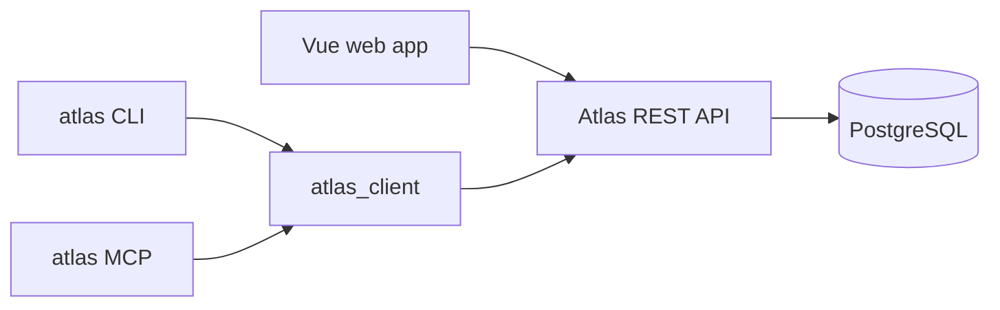

# Atlas documentation

Atlas is a multi-workspace knowledge and task platform with one shared REST API and four first-class clients: the web app, a Tauri desktop app wrapping it, the CLI, and the MCP server.

Use this portal as the reader-friendly entry point. Keep these root docs authoritative when they overlap:

- [`ARCHITECTURE.md`](../ARCHITECTURE.md) — crate map, request lifecycle, permission model, frontend shape.
- [`CODE_STYLE.md`](../CODE_STYLE.md) — coding and verification conventions.
- [`CONTRIBUTING.md`](../CONTRIBUTING.md) — commit workflow and contributor expectations.

## Reading paths

| If you want to… | Start here |
|---|---|
| Understand the product, UX surfaces, and feature set | [Product and features](product.md) |
| Integrate with Atlas over HTTP | [REST API](api.md) |
| Use Atlas from scripts or terminals | [CLI](cli.md) |
| Connect an LLM/agent with MCP | [MCP](mcp.md) |
| Run Atlas locally or configure deployments | [Operations and setup](operations.md) |
| Check caveats before integrating or extending | [Limitations and details](limitations.md) |
| Find the main implementation entry points | [Contributor map](contributor-map.md) |

## System shape

The REST API is the shared contract. The web app, `atlas_client`, `atlas_cli`, and `atlas_mcp` all build on that contract.

## Public contracts

| Surface | What it is | Main reference |
|---|---|---|
| REST API | Axum HTTP server in `atlas_server` | [api.md](api.md) |
| OpenAPI | Generated from `utoipa`, served at `/openapi.json` and `/scalar` | [api.md](api.md) |
| CLI | `clap`-based command line in `atlas_cli` | [cli.md](cli.md) |
| MCP | `rmcp` server in `atlas_mcp` | [mcp.md](mcp.md) |
| Web app | Vue 3 SPA in `apps/web` | [product.md](product.md) |
| Desktop app | Tauri client in `apps/desktop` wrapping the web UI | [nix/README-nightly.md](../nix/README-nightly.md) |

## Maintenance checklist

When behavior changes:

1. Update the source and tests.
2. Update route annotations, schemas, and `ROUTE_REGISTRY` for REST changes.
3. Regenerate web types after contract changes (`gen-types`).
4. Update the relevant page in this docs portal.
5. Record intentional caveats in [limitations.md](limitations.md) instead of leaving them implicit.
